# ARCHITECTURE.md — Verdad Absoluta de la Fábrica de Software IA

> **Proyecto:** CRM IAMET (Gestión de Ventas)  
> **Repositorio:** [https://github.com/DiegoRiv7/CRM-IAMET.git](https://github.com/DiegoRiv7/CRM-IAMET.git)  
> **Última actualización:** 2026-03-05  
> **Estado:** Producción activa en `crm.iamet.mx`

---

## 1. REGLAS DE LA FÁBRICA DE SOFTWARE (Operación Agéntica)

### 1.1 Roles y Responsabilidades

| Rol | Agente | Permisos | Prohibiciones |
|-----|--------|----------|---------------|
| **Director** | Humano (Diego) | Decisión final sobre todo. Define requisitos, prioridades y acepta/rechaza cambios. | — |
| **Arquitecto** | Gemini Pro | Diseñar lógica de negocio, arquitectura de modelos, esquemas de BD, diseño UI/UX, definir APIs y flujos de datos. Generar prompts para el Motor. | No escribe código de producción directamente. |
| **Motor de Construcción** | Manus AI | Recibir prompts del Arquitecto y escribir código: scaffolding, vistas, rutas, controladores, templates, JS/CSS. | **NO** alterar modelos existentes. **NO** inventar dependencias no solicitadas. **NO** modificar `settings.py` ni archivos de despliegue. |
| **Control de Calidad** | Claude / Cursor (Antigravity) | Validar código del Motor, corregir errores de integración, afinar UI/UX, asegurar que compile y funcione en el repositorio local. Refactorizar y optimizar. | **NO** rediseñar arquitectura sin aprobación del Arquitecto. |

### 1.2 Reglas Inquebrantables

1. **Ningún agente modifica `models.py` sin aprobación explícita del Arquitecto.**
2. **Todo cambio de BD requiere migración Django.** Comando: `python manage.py makemigrations && python manage.py migrate`.
3. **No se instalan paquetes nuevos en `requirements.txt`** sin autorización del Director.
4. **El código debe funcionar con la BD SQLite local** (dev) y MySQL 8.0 (producción).
5. **Todo template HTML hereda de `base.html`** o es un partial `_nombre.html` incluido vía ``.
6. **Las APIs siempre retornan JSON** con la estructura definida en la Sección 5.
7. **El CSS usa la convención BEM** cuando aplica y estilos inline para los widgets del CRM Home.
8. **No se usa ningún framework JS** (React, Vue, etc.). Todo es **Vanilla JavaScript**.

### 1.3 Flujo de Trabajo

```
Director (requisito) → Arquitecto (diseño + prompt) → Motor (código) → QA (validación) → Director (aprobación) → Deploy
```

---

## 2. STACK TECNOLÓGICO ACTUAL

### 2.1 Backend

| Componente | Tecnología | Versión |
|-----------|-----------|---------|
| Lenguaje | Python | 3.13 |
| Framework | Django | 5.2.4 |
| WSGI Server | Gunicorn | 23.0.0 |
| BD Producción | MySQL | 8.0 |
| BD Desarrollo | SQLite3 | — |
| ORM | Django ORM | — |
| Archivos estáticos | WhiteNoise | 6.7.0 |
| Generación PDF | WeasyPrint | 65.1 |
| Procesamiento Excel | openpyxl + xlrd | 3.1.2 / 2.0.2 |
| HTTP Client | requests | 2.32.4 |
| Criptografía | cryptography | 43.0.0 |
| Procesamiento Imágenes | Pillow | 11.3.0 |
| Variables de entorno | python-dotenv | 1.1.1 |

### 2.2 Frontend

| Componente | Tecnología | Notas |
|-----------|-----------|-------|
| HTML | Django Templates (Jinja-like) | Herencia con `` y `` |
| CSS | Vanilla CSS + Tailwind CDN (solo dev) | Sin build, estilos inline en widgets |
| JavaScript | Vanilla JS (ES5/ES6) | Sin frameworks, `fetch()` para APIs |
| Calendario | FullCalendar 6.1.11 | CDN, configurado estilo Apple |
| Iconos | SVG inline + Emojis | No se usa Font Awesome ni similares |
| Tipografía | -apple-system, SF Pro (sistema) | No se importan fuentes externas |

### 2.3 Infraestructura de Producción

| Componente | Detalle |
|-----------|---------|
| **VPS** | Ubuntu Server |
| **Dominio** | `nethive.mx` (SSL via Nginx) |
| **Reverse Proxy** | Nginx (contenedor Docker separado) |
| **Contenedores** | Docker + Docker Compose |
| **Red Docker** | `nginx_default` (external) |
| **Usuario servidor** | `iamet2026` |
| **Ruta en servidor** | `/home/iamet2026/crm-iamet/` |
| **Puerto interno** | `8000` (Gunicorn) |
| **Puerto DB** | `3306` (MySQL) |
| **Memoria Docker** | Límite 2084MB, reserva 512MB |

### 2.4 Variables de Entorno (`.env`)

```env
DJANGO_SECRET_KEY=<clave-secreta>
DJANGO_DEBUG=True|False
DJANGO_ALLOWED_HOSTS=nethive.mx,www.nethive.mx,127.0.0.1,localhost,65.99.205.114
CSRF_TRUSTED_ORIGINS=https://nethive.mx,https://www.nethive.mx,...

# Integraciones externas
BITRIX_WEBHOOK_URL=<url-webhook-bitrix24>
BITRIX_WEBHOOK_TOKEN=<token>
INCREMENTA_API_TOKEN=<token>
GEMINI_API_TOKEN=<token>
MAIL_ENCRYPTION_KEY=<clave-fernet>

# Base de datos (Producción = MySQL)
DB_NAME=cartera_clientes_db
DB_USER=djrc312
DB_PASSWORD=<contraseña>
MYSQL_ROOT_PASSWORD=<contraseña-root>
DB_HOST=db               # nombre del servicio Docker
DB_PORT=3306

# Para forzar SQLite en dev local:
DB_ENGINE=sqlite          # Solo setear en desarrollo
```

### 2.5 Integraciones Externas

| Servicio | Uso | Módulo |
|----------|-----|--------|
| **Bitrix24** | Sincronización de oportunidades, contactos, proyectos y archivos | `app/bitrix_integration.py` |
| **Incrementa** | Generación de cotizaciones automatizadas | API REST |
| **Gemini AI** | Generación de avatares con IA | API REST |
| **IMAP/SMTP** | Módulo de correo electrónico integrado | `app/views_mail.py` |

---

## 3. PATRONES DE ARQUITECTURA Y CARPETAS

### 3.1 Estructura del Proyecto

```
Gesti-n-de-ventas/                    # Raíz del proyecto
├── manage.py                          # Django CLI
├── .env                               # Variables de entorno
├── requirements.txt                   # Dependencias Python
├── Dockerfile                         # Imagen Docker (python:3.13-slim)
├── docker-compose.yml                 # Orquestación (web + db)
├── docker-entrypoint.sh               # Script de inicio Docker
├── nginx.conf                         # Config Nginx para producción
├── ARCHITECTURE.md                    # ← Este archivo
│
├── cartera_clientes/                  # Proyecto Django (settings)
│   ├── settings.py                    # Configuración principal
│   ├── urls.py                        # URL raíz (delega a app/urls.py)
│   └── wsgi.py                        # Entry point WSGI
│
├── app/                               # Aplicación principal (ÚNICA)
│   ├── models.py                      # ~3200 líneas, ~45 modelos
│   ├── views.py                       # ~16000 líneas, ~200 vistas
│   ├── views_mail.py                  # Módulo de correo
│   ├── views_exportar.py              # Exportación CSV/Excel
│   ├── views_tarea_comentarios.py     # API comentarios de tareas
│   ├── urls.py                        # ~380 líneas, ~150 rutas
│   ├── forms.py                       # Formularios Django
│   ├── admin.py                       # Configuración admin
│   ├── bitrix_integration.py          # Integración Bitrix24
│   ├── context_processors.py          # Variables globales templates
│   ├── scheduler.py                   # Tareas programadas
│   ├── templatetags/                  # Filtros personalizados
│   │
│   ├── templates/                     # Templates HTML
│   │   ├── base.html                  # Template base (herencia)
│   │   ├── crm_home.html              # Punto de entrada del CRM
│   │   ├── login.html                 # Autenticación
│   │   ├── crm/                       # Partials del CRM Home
│   │   │   ├── _content.html          # Contenido principal (vendedor)
│   │   │   ├── _styles.html           # Estilos globales del CRM
│   │   │   ├── _topbar.html           # Barra superior (Dynamic Island)
│   │   │   ├── _topbar_ingeniero.html # Topbar para ingenieros
│   │   │   ├── _scripts_main.html     # JS principal (~242KB)
│   │   │   ├── _scripts_ingeniero.html# JS dashboard ingeniero
│   │   │   ├── _scripts_mail.html     # JS módulo de correo
│   │   │   ├── _scripts_muro.html     # JS muro social
│   │   │   ├── _actividades_board.html# Dashboard ingeniero HTML
│   │   │   ├── _widget_calendario.html# Widget calendario FullCalendar
│   │   │   ├── _widget_perfil.html    # Widget perfil usuario
│   │   │   ├── _widget_notificaciones.html
│   │   │   ├── _widget_mail.html
│   │   │   ├── _widget_muro.html
│   │   │   ├── _widget_oportunidad.html
│   │   │   ├── _widget_admin.html
│   │   │   ├── _widget_empleados.html
│   │   │   ├── _widget_extras.html
│   │   │   ├── _widget_negociacion.html
│   │   │   └── _widget_cotizar_rapido.html
│   │   ├── todos.html                 # Lista de oportunidades
│   │   ├── proyecto_detalle.html      # Detalle de proyecto
│   │   ├── tareas_proyectos.html      # Tareas y proyectos
│   │   ├── volumetria.html            # Volumetría técnica
│   │   ├── cotizaciones*.html         # Módulos de cotización
│   │   └── ...                        # ~75 templates más
│   │
│   ├── static/                        # Archivos estáticos
│   │   ├── css/                       # Hojas de estilo
│   │   ├── js/                        # JavaScript
│   │   └── images/                    # Imágenes y assets
│   │
│   └── migrations/                    # ~70 migraciones Django
│
├── media/                             # Archivos subidos (uploads)
├── staticfiles/                       # Static files (collectstatic)
└── db.sqlite3                         # BD local de desarrollo
```

### 3.2 Arquitectura de Capas

```
┌─────────────────────────────────────────────────┐
│                    BROWSER                       │
│         (Vanilla JS + fetch() + FullCalendar)    │
└──────────────────────┬──────────────────────────┘
                       │ HTTP (JSON / HTML)
┌──────────────────────▼──────────────────────────┐
│               NGINX (Reverse Proxy)              │
│    static/ → servido directo                     │
│    media/  → servido directo                     │
│    /*      → proxy_pass → Gunicorn :8000         │
└──────────────────────┬──────────────────────────┘
                       │
┌──────────────────────▼──────────────────────────┐
│              DJANGO (app/views.py)                │
│                                                   │
│  ┌─── Vistas HTML ───┐  ┌─── API Views ────────┐ │
│  │ render(template)   │  │ JsonResponse({...})   │ │
│  │ redirect()         │  │ @csrf_exempt          │ │
│  └────────────────────┘  └──────────────────────┘ │
│              │                      │             │
│  ┌───────────▼──────────────────────▼──────────┐  │
│  │           DJANGO ORM (models.py)            │  │
│  │     QuerySet API + signals + validators     │  │
│  └─────────────────────┬───────────────────────┘  │
└────────────────────────┼──────────────────────────┘
                         │
         ┌───────────────▼───────────────┐
         │     MySQL 8.0 (Producción)    │
         │     SQLite3 (Desarrollo)      │
         └───────────────────────────────┘
```

### 3.3 Patrón de Comunicación

1. **URL** (`app/urls.py`) → Define la ruta y la mapea a una función vista.
2. **Vista** (`app/views.py`) → Procesa la request. Si es página, renderiza template. Si es API, retorna JSON.
3. **Modelo** (`app/models.py`) → Define la estructura de datos y lógica de BD.
4. **Template** (`app/templates/`) → Genera el HTML usando Django Template Language.

### 3.4 Patrón de la Página CRM Home

La página principal del CRM (`/app/home/`) usa un **sistema de islas (widgets overlay)**:

```
crm_home.html
  └──          → CSS global
  └──           → Dynamic Island (menú)
  └── 
  │     
  │       → Dashboard ingeniero
  │   
  │             → Dashboard vendedor
  │   
  └── 
  └── 
  └── 
  └── 
  └── 
  └── 
  └── ... (más widgets)
  └── 
  └── 
  └── 
  └── 
```

Los widgets son **divs con `position: fixed`** y `display: none` que se muestran como overlays flotantes.

### 3.5 Sistema de Roles

| Rol | Variable Template | Permisos |
|-----|-------------------|----------|
| **Supervisor** | `request.user.is_superuser` | Todo: CRUD completo, ver datos de todos, admin |
| **Vendedor** | `perfil.rol == 'vendedor'` | CRM de ventas, cotizaciones, volumetrías propias |
| **Ingeniero** | `perfil.rol == 'ingeniero'` | Dashboard de proyectos, programación, tareas técnicas |

---

## 4. ESQUEMA DE BASE DE DATOS ACTUAL

### 4.1 Diagrama de Relaciones (Simplificado)

```mermaid
erDiagram
    User ||--o{ UserProfile : "1:1"
    User ||--o{ TodoItem : "created_by"
    User ||--o{ Proyecto : "creador"
    User ||--o{ Tarea : "responsable"
    User ||--o{ Actividad : "creado_por"
    User }o--o{ ProgramacionActividad : "responsables (M2M)"
    
    TodoItem ||--o{ Cotizacion : "oportunidad"
    TodoItem ||--o{ Volumetria : "oportunidad"
    TodoItem ||--o{ OportunidadActividad : "oportunidad"
    TodoItem ||--o{ OportunidadComentario : "oportunidad"
    TodoItem ||--o{ OportunidadArchivo : "oportunidad"
    TodoItem ||--o{ TareaOportunidad : "oportunidad"
    TodoItem ||--o{ MensajeOportunidad : "oportunidad"
    TodoItem ||--o{ CarpetaOportunidad : "oportunidad"
    TodoItem ||--o{ ArchivoOportunidad : "oportunidad"
    TodoItem ||--o{ ProductoOportunidad : "oportunidad"
    
    Cliente ||--o{ TodoItem : "cliente"
    Cliente ||--o{ Contacto : "cliente"
    
    Cotizacion ||--o{ DetalleCotizacion : "cotizacion"
    Volumetria ||--o{ DetalleVolumetria : "volumetria"
    Volumetria ||--o{ CableadoNodoRed : "volumetria"
    Volumetria ||--o{ InfraestructuraTuberia : "volumetria"
    Volumetria ||--o{ ManoObraVolumetria : "volumetria"
    
    Proyecto ||--o{ Tarea : "oportunidad"
    Proyecto ||--o{ ProyectoComentario : "proyecto"
    Proyecto ||--o{ CarpetaProyecto : "proyecto"
    
    Tarea ||--o{ TareaComentario : "tarea"
    
    Marca ||--o{ ProductoCatalogo : "marca"
```



### 4.2 Modelos Principales

#### Módulo: Usuarios y Perfiles

| Modelo | Campos Clave | Descripción |
|--------|-------------|-------------|
| `UserProfile` | `user` (1:1→User), `rol` (vendedor/ingeniero), `avatar_tipo`, `color_preferido`, `bitrix_user_id` | Extiende User con rol, avatar y preferencias |
| `SolicitudCambioPerfil` | `usuario`, `campo`, `valor_anterior`, `valor_nuevo`, `estado` | Solicitudes de cambio que requieren aprobación |

#### Módulo: CRM de Ventas

| Modelo | Campos Clave | Descripción |
|--------|-------------|-------------|
| `Cliente` | `nombre_empresa`, `responsable`→User, `categoria` (A/B/C), `meta_mensual` | Clientes con categoría de utilidad |
| `Contacto` | `nombre`, `apellido`, `email`, `telefono`, `cliente`→Cliente | Contactos de clientes |
| `TodoItem` | `titulo`, `cliente`, `responsable`→User, `monto`, `producto`, `estatus`, `probabilidad`, `bitrix_lead_id` | **Oportunidad de venta** (modelo principal) |
| `ProductoOportunidad` | `oportunidad`→TodoItem, `producto`, `notas` | Productos vinculados a oportunidad |
| `OportunidadEstado` | `nombre`, `estado`, `color`, `icono`, `orden` | Estados personalizados |
| `OportunidadActividad` | `oportunidad`→TodoItem, `tipo`, `usuario`→User, `descripcion`, `estado_anterior/nuevo` | Timeline de actividades |
| `OportunidadComentario` | `oportunidad`→TodoItem, `usuario`→User, `contenido`, `comentario_padre` | Comentarios anidados |
| `OportunidadArchivo` | `oportunidad`→TodoItem, `archivo`, `tipo_archivo`, `subido_por`→User | Archivos adjuntos |
| `TareaOportunidad` | `oportunidad`→TodoItem, `titulo`, `responsable`→User, `estado`, `prioridad`, `fecha_limite` | Tareas por oportunidad |
| `ComentarioTareaOpp` | `tarea`→TareaOportunidad, `autor`→User, `contenido` | Comentarios en tareas |
| `MensajeOportunidad` | `oportunidad`→TodoItem, `autor`→User, `texto`, `imagen`, `reply_to` | Chat/bitácora |

#### Módulo: Cotizaciones

| Modelo | Campos Clave | Descripción |
|--------|-------------|-------------|
| `Cotizacion` | `titulo`, `oportunidad`→TodoItem, `tipo_cotizacion` (Bajanet/Iamet), `subtotal`, `iva`, `total`, `created_by`→User | Cotización con totales |
| `DetalleCotizacion` | `cotizacion`→Cotizacion, `marca`, `descripcion`, `cantidad`, `precio_unitario`, `descuento` | Líneas de cotización |

#### Módulo: Volumetría Técnica

| Modelo | Campos Clave | Descripción |
|--------|-------------|-------------|
| `Volumetria` | `titulo`, `oportunidad`→TodoItem, `subtotal`, `iva`, `total`, `notas_tecnicas` | Volumetría de cableado |
| `DetalleVolumetria` | `volumetria`→Volumetria, `no_parte`, `descripcion`, `cantidad`, `precio_venta` | Líneas de volumetría |
| `CableadoNodoRed` | `volumetria`→Volumetria, `total_nodos`, config de cables/jacks/faceplates | Configuración de cableado |
| `InfraestructuraTuberia` | `volumetria`→Volumetria, `tipo_tuberia`, `diametro`, `metros`, precios | Infraestructura tubería |
| `ManoObraVolumetria` | `volumetria`→Volumetria, cantidades y precios de instalación | Mano de obra |
| `CatalogoCableado` | `numero_parte`, `tipo_producto`, `precio_lista`, `precio_distribuidor` | Catálogo de productos |

#### Módulo: Catálogo de Productos

| Modelo | Campos Clave | Descripción |
|--------|-------------|-------------|
| `Marca` | `nombre`, `activa` | Marcas de productos |
| `ProductoCatalogo` | `marca`→Marca, `no_parte`, `descripcion`, `precio_lista`, `precio_distribuidor` | Catálogo importable desde Excel |
| `ImportacionProductos` | `usuario`→User, `archivo`, `productos_actualizados`, `productos_nuevos` | Historial de importaciones |

#### Módulo: Proyectos y Tareas

| Modelo | Campos Clave | Descripción |
|--------|-------------|-------------|
| `Proyecto` | `titulo`, `tipo` (runrate/ingeniería), `privacidad`, `creador`→User, `miembros`→M2M User, `estado`, `oportunidad`→TodoItem | Proyecto con privacidad |
| `ProyectoComentario` | `proyecto`→Proyecto, `usuario`→User, `contenido`, `tipo`, `comentario_padre` | Feed/comentarios |
| `ProyectoArchivo` | `comentario`→ProyectoComentario, `archivo`, `nombre_original` | Archivos en comentarios |
| `Tarea` | `titulo`, `oportunidad`→Proyecto, `responsable`→User, `estado`, `prioridad`, `fecha_limite`, `tiempo_invertido`, `board_items`→JSON | Tareas con timer y board |
| `TareaComentario` | `tarea`→Tarea, `usuario`→User, `contenido` | Comentarios en tareas |
| `TareaArchivo` | `comentario`→TareaComentario, `archivo` | Archivos en comentarios |

#### Módulo: Calendario y Programación

| Modelo | Campos Clave | Descripción |
|--------|-------------|-------------|
| `Actividad` | `titulo`, `tipo_actividad`, `fecha_inicio`, `fecha_fin`, `color`, `creado_por`→User, `participantes`→M2M User, `oportunidad`→TodoItem | Eventos del calendario |
| `ProgramacionActividad` | `proyecto_key`, `titulo`, `dia_semana`, `hora_inicio`, `hora_fin`, `responsables`→M2M User, `fecha` | Programación semanal de proyectos |

#### Módulo: Drive de Archivos

| Modelo | Campos Clave | Descripción |
|--------|-------------|-------------|
| `CarpetaProyecto` | `nombre`, `proyecto`→Proyecto, `carpeta_padre`→self | Carpetas jerárquicas |
| `ArchivoProyecto` | `carpeta`→CarpetaProyecto, `archivo`, `tipo`, `tamaño`, `subido_por`→User | Archivos en carpetas |
| `CompartirArchivo` | `archivo`→ArchivoProyecto, `usuario`→User, `puede_editar` | Permisos de archivo |
| `CarpetaOportunidad` | `nombre`, `oportunidad`→TodoItem, `carpeta_padre`→self | Carpetas por oportunidad |
| `ArchivoOportunidad` | `oportunidad`→TodoItem, `carpeta`→CarpetaOportunidad, `archivo` | Archivos por oportunidad |

#### Módulo: Notificaciones y Social

| Modelo | Campos Clave | Descripción |
|--------|-------------|-------------|
| `Notificacion` | `usuario`→User, `tipo` (mencion/respuesta/tarea/programacion_proyecto/...), `titulo`, `mensaje`, `leida`, `oportunidad`, `proyecto`, `tarea` | Sistema de notificaciones |
| `PostMuro` | `autor`→User, `contenido`, `imagen`, `likes`→M2M User | Publicaciones del muro |
| `ComentarioMuro` | `post`→PostMuro, `autor`→User, `contenido` | Comentarios del muro |

#### Módulo: Recursos Humanos

| Modelo | Campos Clave | Descripción |
|--------|-------------|-------------|
| `AsistenciaJornada` | `usuario`→User, `fecha`, `hora_entrada`, `hora_salida`, `estado`, `pausas_json` | Control de jornada |
| `EficienciaMensual` | `usuario`→User, `mes`, `anio`, `porcentaje`, `tareas_completadas`, `actividades_completadas` | Métricas de eficiencia |
| `EmpleadoDelMes` | `usuario`→User, `mes`, `ano`, `monto_total` | Empleado del mes |

#### Módulo: Intercambio Navideño

| Modelo | Campos Clave | Descripción |
|--------|-------------|-------------|
| `IntercambioNavidad` | `año`, `estado`, `monto_sugerido`, `fecha_intercambio` | Evento de intercambio |
| `ParticipanteIntercambio` | `intercambio`→IntercambioNavidad, `usuario`→User, `asignado_a`→User, `regalo_entregado` | Participantes y asignaciones |
| `HistorialIntercambio` | `intercambio`→IntercambioNavidad, `accion`, `usuario`→User, `detalles`→JSON | Registro de acciones |

#### Otros

| Modelo | Descripción |
|--------|-------------|
| `OportunidadProyecto` | Vínculo oportunidad↔proyecto Bitrix24 |
| `PendingFileUpload` | Cola de archivos pendientes de subir a Bitrix |
| `ArchivoFacturacion` | Archivos XLS de facturación mensual |
| `SolicitudAccesoProyecto` | Solicitudes de acceso a proyectos privados |

---

## 5. CONVENCIONES DE CÓDIGO

### 5.1 Nomenclatura

| Elemento | Convención | Ejemplo |
|----------|-----------|---------|
| Modelos | `PascalCase` | `ProgramacionActividad` |
| Campos de modelo | `snake_case` | `fecha_creacion`, `hora_inicio` |
| Funciones/vistas | `snake_case` | `api_programacion_actividades` |
| URLs API | `kebab-case` con prefijo `api/` | `/app/api/programacion/actividades/` |
| URLs páginas | `kebab-case` | `/app/crear-cotizacion/` |
| Templates HTML | `snake_case.html` | `cotizaciones_por_oportunidad.html` |
| Templates parciales | `_snake_case.html` | `_widget_calendario.html` |
| Variables JS | `camelCase` | `_dashCurrentView`, `dashRenderCalendar` |
| Funciones JS globales | `camelCase` con prefijo del módulo | `dashAddCalAct()`, `calFilterByUser()` |
| CSS clases | `kebab-case` o BEM | `dash-cal-card`, `dash-seg-active` |
| Constantes Python | `UPPER_SNAKE_CASE` | `TIPO_CHOICES`, `ESTADO_CHOICES` |

### 5.2 Estructura de Respuestas API

#### Éxito — Operaciones de lectura (GET):
```json
{
    "success": true,
    "items": [ ... ],
    "total": 42
}
```

#### Éxito — Operaciones de escritura (POST/PUT):
```json
{
    "success": true,
    "id": 123,
    "message": "Creado correctamente"
}
```

#### Error:
```json
{
    "success": false,
    "error": "Descripción del error"
}
```
o
```json
{
    "error": "Descripción del error"
}
```

#### Error con datos adicionales (conflictos):
```json
{
    "error": "conflicto",
    "conflictos": [
        {"usuario": "Juan", "actividad": "Reunión", "hora": "08:00-09:00"}
    ]
}
```

### 5.3 Autenticación y Seguridad

- **Autenticación:** `@login_required` decorator en todas las vistas.
- **CSRF:** Token vía `` en forms o `X-CSRFToken` header en fetch().
- **Obtención del CSRF en JS:**
  ```javascript
  function getCSRF() {
      var el = document.querySelector('[name=csrfmiddlewaretoken]');
      if (el) return el.value;
      var match = document.cookie.match(/csrftoken=([^;]+)/);
      return match ? match[1] : '';
  }
  ```
- **Permisos de supervisor:** `request.user.is_superuser` o helper `is_supervisor(request.user)`.
- **Permisos de rol:** `request.user.userprofile.rol == 'ingeniero'`.

### 5.4 Patrones de Vista

```python
# Vista de página HTML
@login_required
def nombre_vista(request):
    contexto = { ... }
    return render(request, 'template.html', contexto)

# Vista API (GET + POST en la misma función)
@login_required
def api_nombre(request):
    if request.method == 'GET':
        data = Model.objects.filter(...)
        return JsonResponse({'success': True, 'items': [...]})
    elif request.method == 'POST':
        data = json.loads(request.body)
        obj = Model.objects.create(**data)
        return JsonResponse({'success': True, 'id': obj.id})
    return JsonResponse({'error': 'Método no permitido'}, status=405)

# Vista API de detalle (PUT + DELETE)
@login_required
def api_nombre_detail(request, pk):
    obj = get_object_or_404(Model, pk=pk)
    if request.method == 'PUT':
        data = json.loads(request.body)
        # actualizar campos...
        obj.save()
        return JsonResponse({'success': True})
    elif request.method == 'DELETE':
        obj.delete()
        return JsonResponse({'success': True})
```

### 5.5 Patrones de JavaScript

```javascript
// Fetch con CSRF para POST/PUT/DELETE
fetch('/app/api/recurso/', {
    method: 'POST',
    headers: {
        'Content-Type': 'application/json',
        'X-CSRFToken': getCSRF()
    },
    body: JSON.stringify({ campo: valor })
})
.then(function(r) { return r.json(); })
.then(function(d) {
    if (d.success) { /* éxito */ }
    else { alert(d.error || 'Error'); }
})
.catch(function(e) { console.error(e); });
```

### 5.6 Reglas de Templates

1. **Herencia:** `` para páginas completas.
2. **Inclusión:** `` para componentes.
3. **Variables Django en JS:** `var x = {{ variable|yesno:"true,false" }};` (sin espacios en el filtro).
4. **Escape HTML en JS:** Siempre usar funciones `escH()` / `escA()` / `woEscape()`.
5. **IDs únicos:** Todo elemento interactivo debe tener `id` único y descriptivo con prefijo de módulo (`dash`, `cal`, `wo`).

### 5.7 Despliegue

```bash
# En el servidor (como iamet2026):
cd ~/crm-iamet

# Reconstruir y reiniciar
docker-compose down
docker-compose up -d --build

# Ver logs
docker-compose logs -f web

# Migrar BD
docker-compose exec web python manage.py migrate

# Recolectar estáticos
docker-compose exec web python manage.py collectstatic --noinput
```

---

> **Este documento es la Verdad Absoluta para la Fábrica de Software IA.**  
> Cualquier agente que modifique el código debe respetar estrictamente las reglas, convenciones y patrones aquí documentados.
